## 基于 SpringBoot + Vue3 + DeepSeek 的电影世界

### 功能及截图

该项目涵盖数据分析与处理、后端开发、前端开发等知识，具备以下功能：

- **AI 问答**
- 用户注册、登录
- **收藏电影**
- **用户反馈**
- 后台查看**用户活跃度**信息
- 后台查看、回复用户反馈信息
- 后台电影数据管理
- 用户权限控制

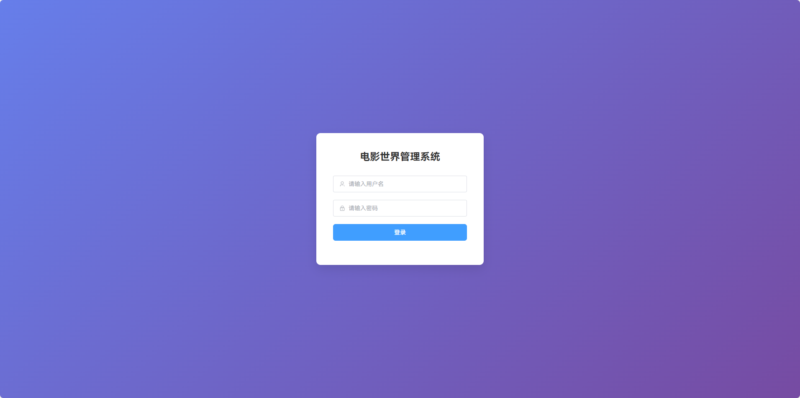

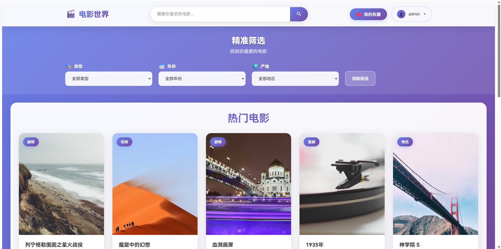

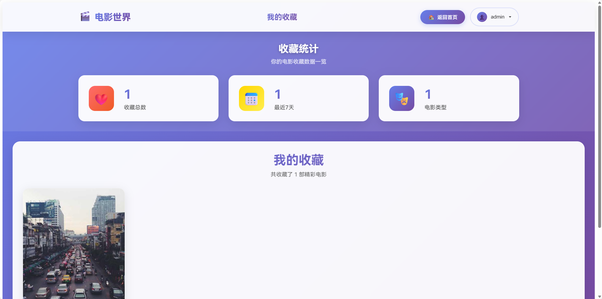

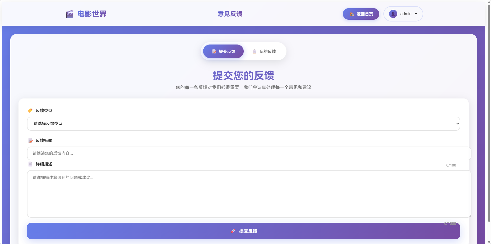

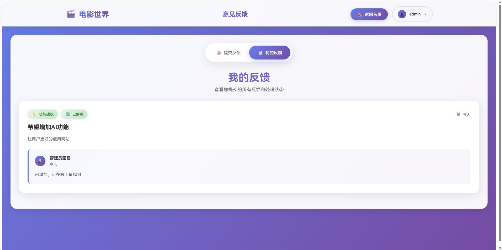

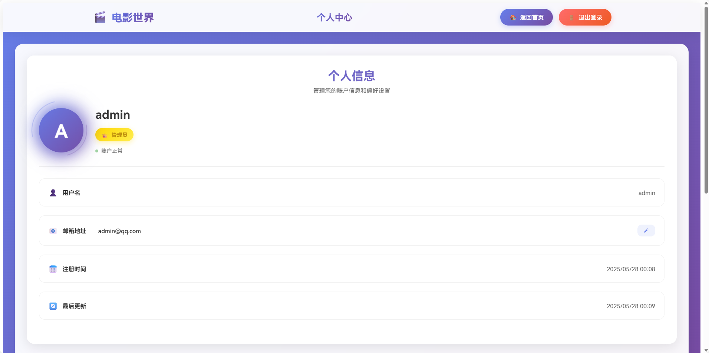

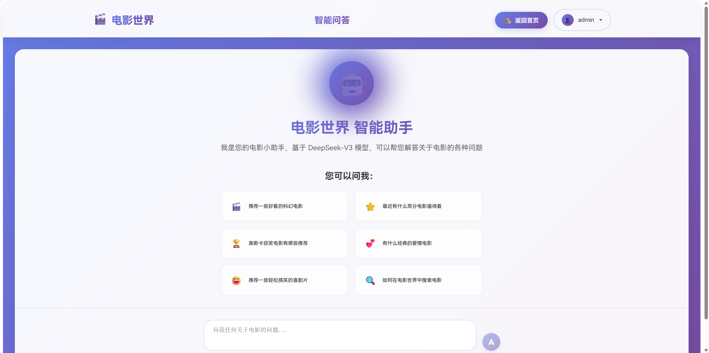

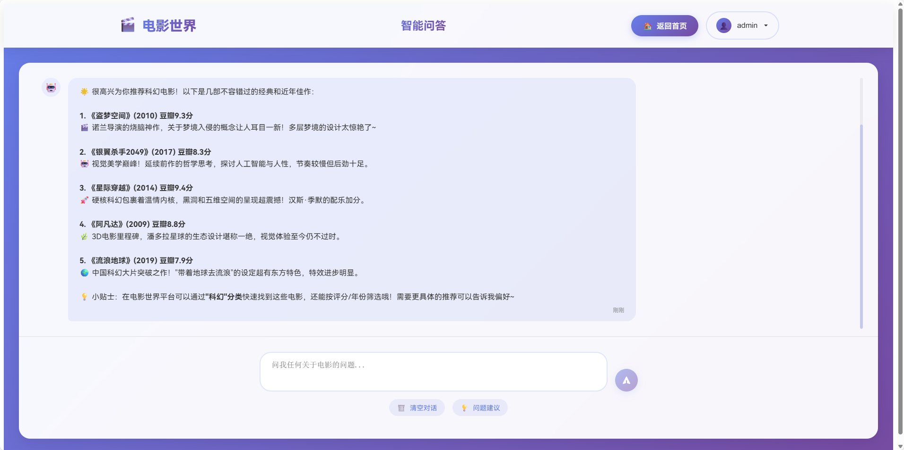


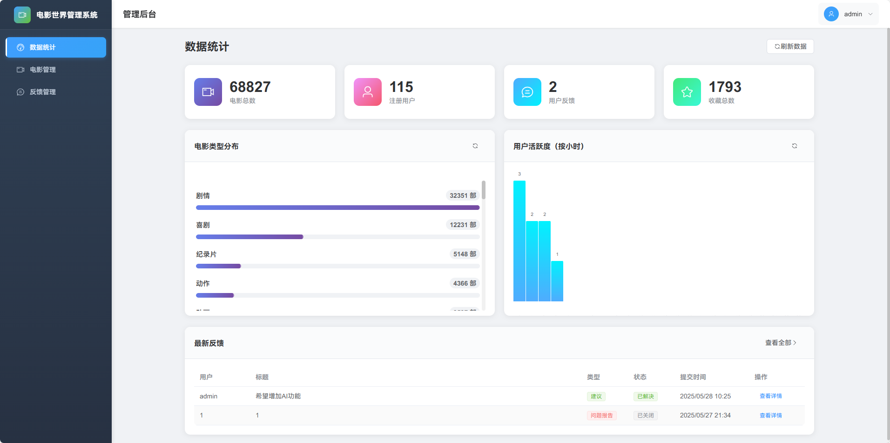

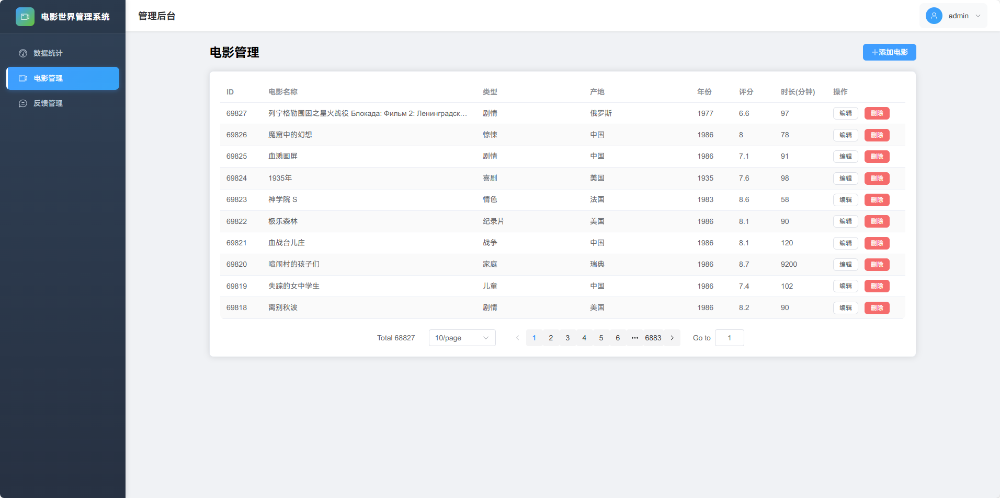

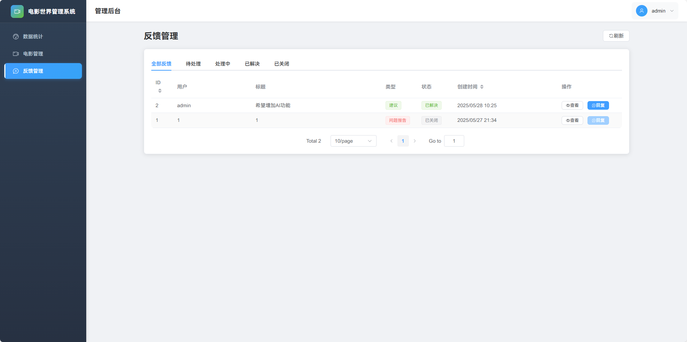

### 说明

- `backend`：后端文件夹
- `data-processing`：数据分析与处理文件夹，包含相关代码、处理前后数据
- `frontend-user`：前端（用户端）文件夹
- `frontend-admin`：前端（管理端）文件夹，**登录账号密码均为 admin**
- `database`：数据库文件夹
- `images`：功能截图文件夹
- `api-doc.md`：接口文档
- `README.md`：说明文档（本文档）

### 数据来源

[豆瓣电影数据 - Heywhale.com](https://www.heywhale.com/mw/dataset/6117880efe727700176cf0c2/file)

共 38738 条，包含电影名、投票人数、类型、产地、上映时间、时长、年代、评分、首映地点

### 技术栈

数据分析与处理：Numpy、Pandas

后端：SpringBoot、MyBatis

前端：Vue、Pinia、Axios

AI：DeepSeek

### 运行

1. 下载整个项目

2. 将数据库文件（`movie.sql`）导入本地数据库

3. 将 `backend` 文件夹拖入 IDEA

4. 修改 `backend/src/main/resources/application.yml` 中的数据连接信息

   ```yml
   spring:
     datasource:
       url: jdbc:mysql://localhost:3306/movie?useUnicode=true&characterEncoding=utf8&useSSL=false&allowPublicKeyRetrieval=true&serverTimezone=Asia/Shanghai
       username: root
       password: 123456
       driver-class-name: com.mysql.cj.jdbc.Driver
   ```

   把 3306 改为你的数据库端口号，把 username 和 password 改为你的数据库用户名和密码

5. 进入 `backend/pom.xml`，点击 IDEA 右上角的 Maven 图标，安装所需依赖

6. 运行启动类 `backend/src/main/java/com/movie/backend/BackendApplication.java`

7. 将 `frontend-user`、`frontend-admin` 拖入 VSCode，打开 VSCode 集成终端，输入 `npm i` 安装所需依赖

8. 将 `SmartQA.vue` 页面中的 apiKey 替换成你自己的 DeepSeek Platform 的 api-key

   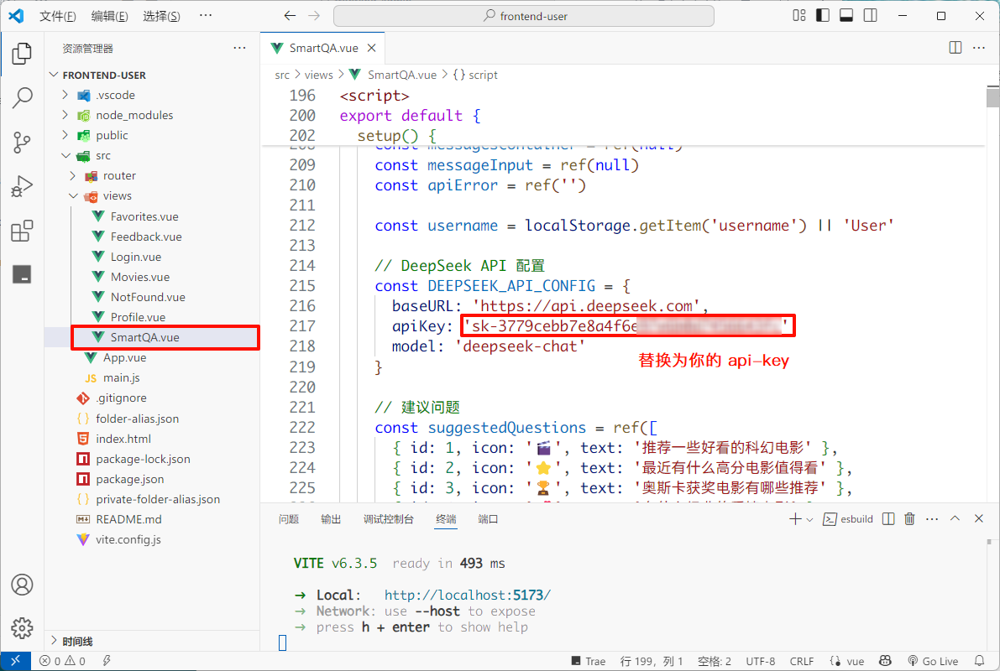

9. 在集成终端中输入 `npm run dev` 分别运行两个前端项目，并根据输出的网址打开页面

### 开发过程

1. 下载数据后，进行数据分析与处理，将无效数据（如名称中只有“1”或空白）剔除，**最终剩余 38173 条**
2. 将数据存入数据库
3. 设计数据库，分为五个表：movies（电影表）、user_favorites（收藏表）、user_feedback（反馈表）、user_login_log（登录记录表）、users（用户表）
4. 编写后端代码、接口文档
5. 编写前端代码（用户端、管理端）